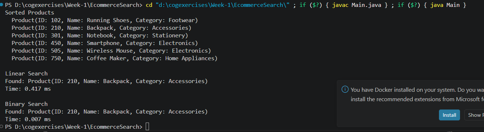

# Exercise 2: E-commerce Platform Search Function

---

## Problem Statement

The given problem was:

> You are developing the search functionality for an e-commerce platform. Implement different searching algorithms to locate products efficiently and compare their performance.

### Steps

1. Understand Linear Search and Binary Search.
2. Create a `Product` class with appropriate attributes.
3. Implement Linear Search to locate a product by its ID.
4. Implement Binary Search for faster searching on sorted data.
5. Compare the performance of both algorithms and discuss their time complexity.

---

## Project Setup

I created a Java project in Visual Studio Code and implemented the solution in a single file named `Main.java`.

The program contains three classes:

* `Product` – Represents a product with an ID, name, and category.
* `SearchAlgorithms` – Contains the implementations of Linear Search and Binary Search.
* `Main` – Creates sample products, sorts them, performs both searches, and compares their execution time.

---

## Implementation

To begin, I created a `Product` class containing three fields:

* `productId`
* `productName`
* `category`

I also implemented the `Comparable<Product>` interface so that `Arrays.sort()` could sort products based on their IDs before performing Binary Search.

### Linear Search

The Linear Search algorithm simply checks each product one by one until the required product ID is found.

```java
for (Product product : products) {
    if (product.getProductId() == targetId) {
        return product;
    }
}
```

This approach works even if the array is unsorted because every element is examined sequentially.

### Binary Search

Binary Search requires the array to be sorted beforehand.

The algorithm repeatedly compares the target ID with the middle element of the array. Depending on the comparison, it discards one half of the remaining search space until either the product is found or no elements remain.

Before performing Binary Search, I cloned the original array and sorted the copy using:

```java
Arrays.sort(sortedArray);
```

This preserves the original order of the products while allowing Binary Search to work correctly.

---

## Understanding the Search Algorithms

Initially, the difference between Linear Search and Binary Search seemed simple—one checks every element while the other is "faster." However, implementing both made the reason much clearer.

Linear Search makes no assumptions about the data. Since the products can be stored in any order, it simply starts from the beginning and checks every product until it finds the required one.

Binary Search is different because it depends entirely on the data already being sorted. Once the products are arranged by their IDs, the algorithm can eliminate half of the remaining search space after every comparison. Instead of checking every element, it quickly narrows down where the target can exist.

I also realized why implementing the `Comparable` interface was necessary. `Arrays.sort()` needs a way to compare two `Product` objects, and overriding the `compareTo()` method tells Java that products should be sorted according to their `productId`.

---

## Analysis

### Linear Search

Linear Search may need to examine every product before finding the target.

* **Best Case:** O(1) – the first product matches.
* **Worst Case:** O(n) – the target is the last product or doesn't exist.
* **Space Complexity:** O(1)

### Binary Search

Binary Search repeatedly halves the search space.

* **Best Case:** O(1) – the middle element is the target.
* **Worst Case:** O(log n)
* **Space Complexity:** O(1)

The only additional requirement is that the data must already be sorted before Binary Search can be applied.

---

## Performance Comparison

To compare both algorithms, I measured their execution times using:

```java
long start = System.nanoTime();
...
long end = System.nanoTime();
```

The elapsed time was converted from nanoseconds to milliseconds before printing.

With only a few products, both searches complete almost instantly, so the measured times are very close. However, as the number of products increases, Binary Search becomes significantly faster because its running time grows logarithmically instead of linearly.

---

## Why the Current Implementation Was Kept

The objective of this exercise was to demonstrate both searching algorithms and compare how they work.

For that reason:

* The product list was intentionally kept small and easy to understand.
* The original array was left unchanged by sorting a cloned copy before Binary Search.
* Both search methods were implemented separately so that their behavior and performance could be observed independently.

Although Java provides built-in search utilities, implementing the algorithms manually helped me understand how each one works internally.

---

## Output

Running the program first displays the sorted list of products, followed by the results of both Linear Search and Binary Search along with the execution time for each algorithm.


