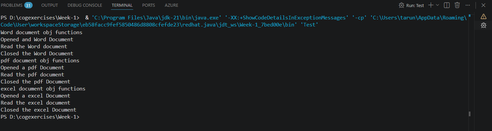

# Factory Method Pattern Example

## Note

This README was originally written by me. I used AI assistance only to improve the formatting and convert the content into a more readable Markdown document. The implementation, understanding, and explanation of the project are my own.

---

## Problem Statement

The given problem was:

> You are developing a document management system that needs to create different types of documents (e.g., Word, PDF, Excel). Use the Factory Method Pattern to achieve this.

### Steps

1. Create a new Java project named **FactoryMethodPatternExample**.
2. Define the document classes:

   * Create an interface or abstract class for different document types such as `WordDocument`, `PdfDocument`, and `ExcelDocument`.
3. Create the concrete document classes:

   * Implement concrete classes for each document type that implement or extend the above interface or abstract class.
4. Implement the Factory Method:

   * Create an abstract class `DocumentFactory` with a method `createDocument()`.
   * Create concrete factory classes for each document type that extend `DocumentFactory` and implement the `createDocument()` method.
5. Test the Factory Method implementation:

   * Create a test class to demonstrate the creation of different document types using the factory method.

---

## Project Setup

I created a Java project in Visual Studio Code and organized the files into separate packages to keep the project modular and easy to understand.

* **`documents` package** – Contains the `Document` interface and the concrete document classes (`WordDocument`, `PdfDocument`, and `ExcelDocument`).
* **`factories` package** – Contains the abstract `DocumentFactory` class and the concrete factory classes (`WordDocumentFactory`, `PdfDocumentFactory`, and `ExcelDocumentFactory`).
* **Root (`src`)** – Contains the `Test.java` file, which acts as the client.

---

## Implementation

Following the requirements, I first created the `Document` interface with the methods `open()`, `read()`, and `close()`. Each document class implements this interface and provides its own implementation of these operations.

Next, I created the abstract `DocumentFactory` class, which declares the factory method `createDocument()` that returns a `Document` object.

I then implemented three concrete factory classes, one for each document type. Each factory overrides the `createDocument()` method and returns an instance of its corresponding document class.

In `Test.java`, the client creates the required factory (for example, `WordDocumentFactory`) and calls its `createDocument()` method to obtain a document object. The client then interacts with the document only through the `Document` interface, without depending on any concrete implementation.

---

## Understanding the Factory Method Pattern

The Factory Method pattern defines a common interface for creating objects while allowing subclasses to decide which concrete object should be instantiated.

Instead of placing all object creation logic inside a single class, each concrete factory is responsible for creating one specific type of object. This keeps the creation process flexible and makes the system easier to extend.

Some advantages of this approach are:

* **Open/Closed Principle** – New document types can be added by creating new document and factory classes without modifying existing code.
* **Loose Coupling** – The client depends only on the `Document` interface and the abstract `DocumentFactory`, not on concrete document classes.
* **Single Responsibility** – Each factory has only one responsibility: creating its corresponding document type.

---

## Struggles and Thought Process

When I first started this exercise, I found the overall structure confusing because it introduced several interfaces, abstract classes, and concrete classes for what seemed like a simple problem.

To understand the pattern, I referred to a Medium article that explained a simpler Factory implementation. In that example, there was only one `VehicleFactory` class that accepted a `String` parameter and used `if-else` statements to decide which object to create.

After reading that, I wondered why this assignment required separate factory classes for every document type.

The questions I kept asking myself were:

1. **Why can't I simply use one `DocumentFactory` that takes a `String` parameter?**
2. **Where do I actually use `WordDocumentFactory`?**
3. **Do I need another class that decides which factory should be created?**

After revisiting the assignment requirements and reading more about the original *Gang of Four* Factory Method pattern, I realized that the Medium article was describing a **Simple Factory**, not the **Factory Method Pattern**.

The key difference is that:

* A **Simple Factory** keeps all creation logic inside one class. While this is straightforward, adding a new document type requires modifying that factory, which violates the Open/Closed Principle.
* The **Factory Method Pattern** delegates object creation to subclasses. Each concrete factory knows how to create only one specific document type, making the design easier to extend.

I also realized that no additional "factory selector" class was required. The client itself decides which concrete factory to instantiate. If the choice needed to be based on user input, a simple `if-else` or `switch` statement inside `Test.java` would be sufficient to select the appropriate factory.

Understanding this distinction helped me see why the assignment was structured this way, even though it introduced more classes than the simpler approach.

---

## Why the Current Implementation Was Kept

The objective of this exercise was to demonstrate the Factory Method pattern as described in the assignment.

Although using separate factory classes increases the number of files, it follows the intended design and makes the system easier to extend.

For example, if a new document type such as `PowerPointDocument` needs to be supported, I would only need to create a new document class and a corresponding factory class. None of the existing factories or document classes would need to be modified.

For the scope of this assignment, the implementation was intentionally kept simple while clearly demonstrating how the Factory Method pattern separates object creation from object usage.

---

## Output

Running the `Test.java` class successfully creates the requested document objects through their respective factories and demonstrates the Factory Method pattern in action.

