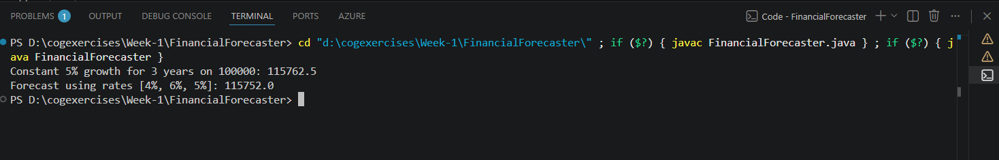

# Exercise 7: Financial Forecasting

---

## Problem Statement

The given problem was:

> You are developing a financial forecasting tool that predicts future values based on past data.

### Steps

1. Understand recursive algorithms and explain how recursion can simplify certain problems.
2. Create a recursive method to calculate future financial values.
3. Implement the recursive algorithm using past growth rates.
4. Analyze the time complexity and discuss possible optimizations to improve the solution.

---

## Project Setup

I created a Java project in Visual Studio Code and implemented the solution inside a class named `FinancialForecaster`.

The class contains:

* `forecastConstant()` – predicts future values assuming a fixed growth rate.
* `forecastVariable()` – predicts future values using a sequence of historical growth rates.
* `main()` – used to test both implementations with sample data.

---

## Implementation

To cover different forecasting scenarios, I implemented two recursive methods.

### Constant Growth Rate

The first method assumes that the growth rate remains the same for every period. During each recursive call, the current value is updated using the recurrence relation:

> **F(t) = F(t − 1) × (1 + g)**

This translates directly into code:

```java
double updatedValue = currentValue * (1 + growthRate);
return forecastConstant(updatedValue, growthRate, periodsAhead - 1);
```

The recursion continues until there are no more periods left to forecast, at which point the current value is returned.

### Variable Growth Rates

The second method accepts an array of growth rates instead of a single fixed value.

A private recursive helper method processes the array one element at a time, applying each growth rate in sequence until every value has been used. This makes it possible to forecast using historical rates such as 4%, 6%, and 5%, rather than assuming that growth remains constant.

---

## Understanding the Recurrence Formula

One part of the exercise that initially confused me was the recurrence formula itself. The problem statement mentioned it, but it didn't clearly explain how it translated into actual code.

After spending some time thinking about it, the formula started to make more sense.

The expression:

> **F(t) = F(t − 1) × (1 + g)**

works because:

* `1` represents the entire current value (100% of it).
* `g` represents the additional growth.

For example, if the current value is ₹100,000 and the growth rate is 5%:

```
100000 × (1 + 0.05)
= 100000 × 1.05
= 105000
```

At first, I wondered why we weren't simply multiplying by `0.05`. Then I realized that doing so would only calculate the growth amount (₹5,000), not the new total value. Adding the `1` includes both the original amount and its growth in a single calculation.

Once I understood that idea, writing the recursive function became much more straightforward.

---

## Analysis

### Time Complexity

Both recursive methods perform one recursive call for each forecasting period.

* For `forecastConstant()`, the number of calls depends on `periodsAhead`.
* For `forecastVariable()`, it depends on the length of the growth rate array.

Since each recursive call performs only a constant amount of work, the overall time complexity is:

**O(n)**

where `n` is the number of periods being processed.

### Space Complexity

Although the algorithm is simple, recursion comes with an additional cost.

Each recursive call remains on the call stack until the base case is reached, so the implementation requires **O(n)** auxiliary space.

For the small test cases used in this exercise, this isn't an issue. However, if the number of forecasting periods became extremely large, the recursion depth could eventually exceed Java's stack limit and result in a `StackOverflowError`.

Learning about this limitation helped me understand that while recursion often produces cleaner code, it isn't always the most practical solution for very large inputs.

---

## Possible Optimizations

Even though the exercise specifically asked for a recursive solution, I looked into a few ways it could be improved.

### 1. Iterative Approach

Since the recursive methods are essentially repeating the same calculation, they could easily be rewritten using a simple `for` loop.

This would reduce the extra space required from **O(n)** to **O(1)** while producing exactly the same result.

### 2. Closed-Form Formula

For a constant growth rate, recursion isn't actually necessary.

The recurrence can be rewritten as:

> **F(n) = F(0) × (1 + g)<sup>n</sup>**

Using `Math.pow()` would produce the result directly without repeatedly calling the recursive method.

### 3. Exponentiation by Squaring

If recursion had to be retained, another option would be exponentiation by squaring.

Instead of making one recursive call per period, the problem can be divided into smaller subproblems, reducing the recursion depth from **O(n)** to **O(log n)**.

Although this approach is more complex, it scales much better for very large inputs.

---

## Why the Current Implementation Was Kept

The purpose of this exercise was to demonstrate recursion rather than build the most optimized forecasting algorithm.

The current implementation was therefore kept intentionally simple because it:

* Clearly illustrates the recursive base case and recursive step.
* Closely follows the mathematical recurrence relation.
* Produces the expected results for the sample inputs provided in the exercise.

The optimization techniques discussed above would be more suitable for a production-level application where efficiency becomes more important.

---

## Output

Running the program successfully forecasts future values for both constant and variable growth rates.

*The slight difference in the decimal values is expected because Java stores floating-point numbers using the `double` data type, which can introduce small rounding errors during arithmetic operations.*


