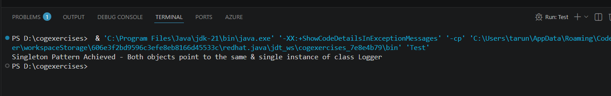

# Singleton Pattern Example


## Problem Statement

The given problem was:

> You need to ensure that a logging utility class in your application has only one instance throughout the application lifecycle to ensure consistent logging.

### Steps

1. Create a new Java project named **SingletonPatternExample**.
2. Define a Singleton class:

   * Create a class named `Logger` that contains a private static instance of itself.
   * Make the constructor of `Logger` private.
   * Provide a public static method that returns the single instance of the `Logger` class.
3. Implement the Singleton Pattern.
4. Test the implementation to verify that only one instance of `Logger` is created and used throughout the application.

---

## Project Setup

I created a Java project in Visual Studio Code and organized it with two Java files:

* `Logger.java` – contains the Singleton implementation.
* `Test.java` – contains the client code used to test the implementation.

---

## Implementation

To satisfy the given requirements, I implemented the `Logger` class as a Singleton by making its constructor private. This prevents any other class from creating objects using the `new` keyword.

A private static instance of the `Logger` class is maintained inside the class itself, and a public static `getInstance()` method is provided to return that instance whenever it is requested.

In `Test.java`, I called the `getInstance()` method multiple times and verified that each call returned the same object, demonstrating that only one instance of the class exists throughout the application's execution.

---

## Understanding the Singleton Pattern

The Singleton pattern ensures that a class has only one instance and provides a single, globally accessible point through which that instance can be obtained.

Its main characteristics are:

* Only one object of the class can exist.
* The object is created and managed by the class itself.
* Every request for the object returns the same instance.

By making the constructor private, object creation is restricted. The static instance and `getInstance()` method work together to ensure controlled access to that single object.

---

## Struggles and Thought Process

At first, the implementation itself was fairly straightforward, but I wanted to understand *why* each part of the pattern was necessary instead of simply copying the code.

One question I had was:

> **"If the constructor is private, how is the object created in the first place?"**

After looking into it, I realized that although other classes cannot create a `Logger` object, the `Logger` class itself can still create one because it has access to its own private members. That is why the static instance is initialized inside the class and exposed through the `getInstance()` method.

Another question that came to mind was:

> **"Why not just create a normal object and pass it wherever it's needed?"**

The purpose of the Singleton pattern is to ensure that there is only one shared instance across the entire application. If multiple logger objects were created independently, it could lead to inconsistent behavior and defeat the purpose of having a centralized logging utility.

Understanding these ideas helped me see that the pattern is not just about restricting object creation—it is about maintaining a single shared resource throughout the application's lifecycle.

---

## Thread Safety Consideration

While studying the Singleton pattern, I also learned that the basic implementation used in this project is **not thread-safe**.

If multiple threads call the `getInstance()` method simultaneously when the instance has not yet been created, more than one object could potentially be instantiated.

Two common approaches to solve this problem are:

### 1. Synchronized Method

```java
public static synchronized Logger getInstance() {
    ...
}
```

This ensures that only one thread can execute the method at a time. However, every call requires acquiring a lock, which can introduce unnecessary overhead.

### 2. Bill Pugh Singleton Pattern

Another commonly used solution is the Bill Pugh Singleton Pattern, which uses a private static inner class.

```java
private static class LoggerHolder {
    private static final Logger INSTANCE = new Logger();
}
```

This approach relies on Java's class-loading mechanism to provide lazy initialization and thread safety without requiring synchronization.

---

## Why the Current Implementation Was Kept

The objective of this exercise was to demonstrate the basic Singleton pattern rather than its thread-safe variants.

Since the project is executed by a single client and does not involve multiple threads, the simple implementation satisfies the given requirements while keeping the code easy to understand.

For larger, real-world applications where multiple threads may access the Singleton simultaneously, a thread-safe implementation such as the synchronized method or the Bill Pugh approach would be more appropriate.

---

## Output

Running the `Test.java` class confirms that every call to `getInstance()` returns the same `Logger` object, demonstrating that only one instance is created during the application's execution.


